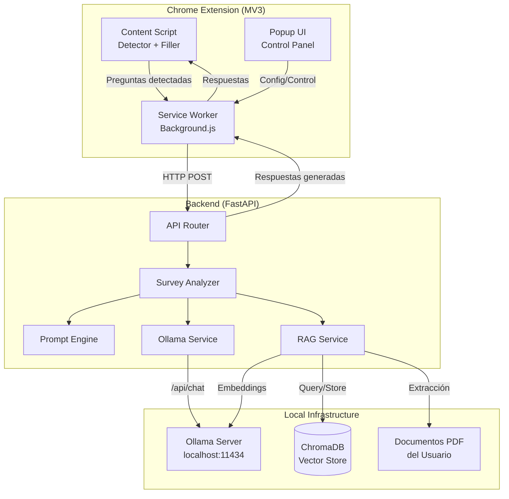

# Survey Copilot — Asistente Local Invisible para Encuestas

Asistente local tipo "copilot invisible" que detecta preguntas en formularios web, las analiza con un LLM local (Ollama), genera respuestas coherentes con el estilo/opiniones del usuario, y opcionalmente autocompleta los formularios.

## Arquitectura General



---

## User Review Required

> [!IMPORTANT]
> **Idioma del código**: Todo el código fuente (variables, comentarios, docstrings) estará en **inglés** para seguir buenas prácticas. La documentación y los mensajes de la UI estarán en **español**. ¿Estás de acuerdo?

> [!IMPORTANT]
> **Modelo principal**: Basado en la investigación, recomiendo **Qwen 2.5 3B** como modelo por defecto (excelente en instrucciones y JSON) con **nomic-embed-text** para embeddings. ¿Tienes preferencia por otro modelo?

> [!WARNING]
> **Uso ético**: Este sistema está diseñado para asistir con encuestas de opinión y formularios repetitivos. No debe usarse para hacer trampa en exámenes académicos. El plan incluye un disclaimer en la UI.

---

## Open Questions

> [!IMPORTANT]
> **Perfil de usuario**: ¿Tienes documentos PDF existentes (apuntes, opiniones escritas, etc.) que quieras usar como base para que el sistema aprenda tu estilo? Si no, el sistema funcionará con prompts configurables.

> [!IMPORTANT]
> **Hardware disponible**: ¿Cuánta RAM y qué GPU tienes? Esto afecta qué tamaño de modelo recomendar:
> - **8 GB RAM, sin GPU** → `qwen2.5:1.5b` + `all-minilm`
> - **16 GB RAM, sin GPU** → `qwen2.5:3b` + `nomic-embed-text`
> - **16+ GB RAM con GPU** → `qwen2.5:7b` + `mxbai-embed-large`

---

## Estructura del Proyecto

```
survey-copilot/
├── backend/
│   ├── app/
│   │   ├── __init__.py
│   │   ├── main.py                  # FastAPI entry point + CORS
│   │   ├── config.py                # Configuración centralizada
│   │   ├── models.py                # Pydantic schemas
│   │   ├── routers/
│   │   │   ├── __init__.py
│   │   │   ├── survey.py            # POST /api/survey/analyze
│   │   │   ├── rag.py               # POST /api/rag/upload, /api/rag/query
│   │   │   └── health.py            # GET /api/health
│   │   ├── services/
│   │   │   ├── __init__.py
│   │   │   ├── ollama_service.py    # Comunicación con Ollama
│   │   │   ├── survey_analyzer.py   # Análisis de preguntas
│   │   │   ├── prompt_engine.py     # Templates de prompts
│   │   │   └── rag_service.py       # Sistema RAG con ChromaDB
│   │   └── utils/
│   │       ├── __init__.py
│   │       └── pdf_loader.py        # Extracción de texto de PDFs
│   ├── data/
│   │   ├── chroma_db/               # Persistencia de vectores
│   │   └── documents/               # PDFs del usuario
│   ├── requirements.txt
│   └── run.py                       # Script de inicio
│
├── extension/
│   ├── manifest.json                # Manifest V3
│   ├── background.js                # Service Worker
│   ├── content.js                   # Script principal (inyectado)
│   ├── modules/
│   │   ├── detector.js              # Detección de preguntas
│   │   └── filler.js                # Auto-completado de respuestas
│   ├── popup/
│   │   ├── popup.html               # UI del popup
│   │   ├── popup.js                 # Lógica del popup
│   │   └── popup.css                # Estilos
│   └── icons/
│       ├── icon16.png
│       ├── icon48.png
│       └── icon128.png
│
├── tests/
│   ├── test_pages/
│   │   ├── simple_survey.html       # Formulario HTML simple
│   │   ├── moodle_mock.html         # Mock de cuestionario Moodle
│   │   └── gforms_mock.html         # Mock de Google Forms
│   └── test_backend.py              # Tests del backend
│
└── README.md
```

---

## Proposed Changes

### Componente 1: Backend FastAPI

El backend actúa como orquestador entre la extensión Chrome y Ollama. Recibe preguntas detectadas, las procesa, consulta el RAG si hay contexto disponible, y genera respuestas.

---

#### [NEW] [requirements.txt](file:///C:/Users/Logan/.gemini/antigravity/scratch/survey-copilot/backend/requirements.txt)

Dependencias del backend:

```
fastapi==0.115.0
uvicorn[standard]==0.30.0
httpx==0.27.0
pydantic==2.9.0
pydantic-settings==2.5.0
chromadb==0.5.0
pymupdf==1.24.0
python-multipart==0.0.9
```

---

#### [NEW] [config.py](file:///C:/Users/Logan/.gemini/antigravity/scratch/survey-copilot/backend/app/config.py)

Configuración centralizada usando `pydantic-settings`:
- `OLLAMA_BASE_URL` (default: `http://localhost:11434`)
- `OLLAMA_MODEL` (default: `qwen2.5:3b`)
- `OLLAMA_EMBED_MODEL` (default: `nomic-embed-text`)
- `CHROMA_DB_PATH` (default: `./data/chroma_db`)
- `DOCUMENTS_PATH` (default: `./data/documents`)
- `DEFAULT_TEMPERATURE` (default: `0.7`)
- `MAX_CONTEXT_LENGTH` (default: `4096`)

---

#### [NEW] [models.py](file:///C:/Users/Logan/.gemini/antigravity/scratch/survey-copilot/backend/app/models.py)

Pydantic schemas para la API:

```python
# Tipos de pregunta soportados
class QuestionType(str, Enum):
    TEXT = "text"              # Respuesta libre
    SINGLE_CHOICE = "single"  # Radio buttons
    MULTIPLE_CHOICE = "multi" # Checkboxes
    SCALE = "scale"           # Escala Likert (1-5, 1-10)
    DROPDOWN = "dropdown"     # Select

# Pregunta detectada por la extensión
class DetectedQuestion:
    question_text: str
    question_type: QuestionType
    options: list[str] | None    # Opciones disponibles
    context: str | None          # Texto circundante
    element_id: str | None       # ID del elemento HTML
    
# Respuesta generada por el backend
class GeneratedAnswer:
    question_text: str
    answer: str                  # Respuesta principal
    confidence: float            # 0.0 - 1.0
    reasoning: str | None        # Razonamiento (debug)
    selected_options: list[int]  # Índices de opciones seleccionadas

# Request/Response completos
class SurveyAnalyzeRequest:
    questions: list[DetectedQuestion]
    survey_context: str | None   # Título/descripción del formulario
    user_profile: str | None     # Perfil/estilo del usuario
    
class SurveyAnalyzeResponse:
    answers: list[GeneratedAnswer]
    model_used: str
    processing_time_ms: float
```

---

#### [NEW] [main.py](file:///C:/Users/Logan/.gemini/antigravity/scratch/survey-copilot/backend/app/main.py)

FastAPI app con:
- CORS middleware (`localhost` origins + extensión Chrome)
- Routers: `/api/health`, `/api/survey`, `/api/rag`
- Startup event: verificar conexión con Ollama
- Middleware de logging para latencia

---

#### [NEW] [ollama_service.py](file:///C:/Users/Logan/.gemini/antigravity/scratch/survey-copilot/backend/app/services/ollama_service.py)

Servicio async para comunicarse con Ollama:
- `generate_response(prompt, system_prompt, options)` → usa `/api/chat`
- `generate_embeddings(texts)` → usa `/api/embed`
- `check_health()` → verifica que Ollama esté corriendo
- `list_models()` → lista modelos disponibles
- Manejo de timeouts (60s para generación, 30s para embeddings)
- Pool de conexiones con `httpx.AsyncClient` reutilizable

---

#### [NEW] [prompt_engine.py](file:///C:/Users/Logan/.gemini/antigravity/scratch/survey-copilot/backend/app/services/prompt_engine.py)

Motor de prompts con templates especializados por tipo de pregunta:

**Prompt para preguntas de texto libre:**
```
Eres un estudiante universitario respondiendo una encuesta de opinión.
Responde de forma natural, como si fueras una persona real.
Usa un tono {tone} y sé {length}.

Contexto de la encuesta: {survey_context}
Perfil del usuario: {user_profile}
Contexto relevante de documentos: {rag_context}

Pregunta: {question}

Responde directamente sin prefijos como "Respuesta:" ni explicaciones.
```

**Prompt para selección múltiple/única:**
```
Analiza la siguiente pregunta de encuesta y selecciona la opción más 
coherente con el perfil dado.

Pregunta: {question}
Opciones:
{numbered_options}

Perfil: {user_profile}
Contexto: {rag_context}

Responde ÚNICAMENTE con el JSON:
{{"selected": [indices], "reasoning": "breve explicación"}}
```

**Prompt para escala Likert:**
```
En una escala de {min} a {max}, ¿cómo responderías a esta pregunta?
Pregunta: {question}
Perfil: {user_profile}

Responde ÚNICAMENTE con el JSON:
{{"value": número, "reasoning": "breve explicación"}}
```

---

#### [NEW] [survey_analyzer.py](file:///C:/Users/Logan/.gemini/antigravity/scratch/survey-copilot/backend/app/services/survey_analyzer.py)

Servicio principal que:
1. Recibe las preguntas detectadas
2. Clasifica cada pregunta por tipo
3. Consulta el RAG para contexto relevante
4. Selecciona el prompt template adecuado
5. Llama a Ollama para generar respuestas
6. Parsea y valida las respuestas
7. Añade variabilidad (no siempre la misma respuesta)

---

#### [NEW] [rag_service.py](file:///C:/Users/Logan/.gemini/antigravity/scratch/survey-copilot/backend/app/services/rag_service.py)

Sistema RAG usando ChromaDB:
- `ingest_pdf(file_path)` → extrae texto, chunking, embeddings, almacena
- `query(text, n_results=3)` → busca chunks relevantes
- `list_documents()` → lista documentos ingestados
- `delete_document(doc_id)` → elimina documento
- Chunking con `RecursiveCharacterTextSplitter` (1000 chars, 200 overlap)
- Persistencia en disco (`./data/chroma_db`)

---

#### [NEW] [pdf_loader.py](file:///C:/Users/Logan/.gemini/antigravity/scratch/survey-copilot/backend/app/utils/pdf_loader.py)

Utilidad para extraer texto de PDFs usando PyMuPDF:
- Extracción page-by-page
- Limpieza de whitespace y caracteres especiales
- Preservación de estructura (headings, listas)

---

#### [NEW] [survey.py (router)](file:///C:/Users/Logan/.gemini/antigravity/scratch/survey-copilot/backend/app/routers/survey.py)

Endpoints:
- `POST /api/survey/analyze` — Recibe preguntas, devuelve respuestas
- `POST /api/survey/analyze-single` — Analiza una sola pregunta (baja latencia)

---

#### [NEW] [rag.py (router)](file:///C:/Users/Logan/.gemini/antigravity/scratch/survey-copilot/backend/app/routers/rag.py)

Endpoints:
- `POST /api/rag/upload` — Sube un PDF para ingestión
- `GET /api/rag/documents` — Lista documentos cargados
- `DELETE /api/rag/documents/{id}` — Elimina un documento
- `POST /api/rag/query` — Consulta manual al RAG

---

#### [NEW] [health.py (router)](file:///C:/Users/Logan/.gemini/antigravity/scratch/survey-copilot/backend/app/routers/health.py)

- `GET /api/health` — Estado del backend + Ollama + ChromaDB

---

### Componente 2: Extensión Chrome (Manifest V3)

La extensión detecta formularios en la página, extrae preguntas, las envía al backend, y opcionalmente rellena las respuestas.

---

#### [NEW] [manifest.json](file:///C:/Users/Logan/.gemini/antigravity/scratch/survey-copilot/extension/manifest.json)

```json
{
  "manifest_version": 3,
  "name": "Survey Copilot",
  "version": "0.1.0",
  "description": "Asistente local para encuestas",
  "permissions": ["activeTab", "storage", "scripting"],
  "host_permissions": ["http://localhost:8000/*"],
  "background": { "service_worker": "background.js" },
  "content_scripts": [{
    "matches": ["<all_urls>"],
    "js": ["modules/detector.js", "modules/filler.js", "content.js"],
    "css": ["content.css"],
    "run_at": "document_idle"
  }],
  "action": {
    "default_popup": "popup/popup.html",
    "default_icon": { "16": "icons/icon16.png", "48": "icons/icon48.png" }
  }
}
```

---

#### [NEW] [detector.js](file:///C:/Users/Logan/.gemini/antigravity/scratch/survey-copilot/extension/modules/detector.js)

Motor de detección de preguntas en el DOM:

1. **Detecta elementos de formulario**: `input[type=text|radio|checkbox]`, `textarea`, `select`
2. **Agrupa por pregunta**: Encuentra labels, `aria-label`, texto circundante
3. **Clasifica tipo**: text, single_choice, multi_choice, scale, dropdown
4. **Extrae opciones**: Para radio/checkbox/select, extrae las opciones disponibles
5. **Soporte específico por plataforma**:
   - HTML genérico: busca `<form>`, `<fieldset>`, `<label>`
   - Moodle: detecta `.que`, `.formulation`, `.answer` classes
   - Google Forms: detecta `[data-params]`, `.freebirdFormviewerComponentsQuestionBaseRoot`

Estrategia de detección (cascada):
```
1. Buscar <form> elements
2. Dentro de cada form, buscar grupos de preguntas
3. Para cada grupo:
   a. Encontrar el texto de la pregunta (label, legend, heading cercano)
   b. Encontrar los elementos de entrada (input, textarea, select)
   c. Clasificar el tipo de pregunta
   d. Extraer opciones si aplica
4. Si no hay <form>, buscar patrones conocidos (Moodle, GForms)
5. Construir array de DetectedQuestion objects
```

---

#### [NEW] [filler.js](file:///C:/Users/Logan/.gemini/antigravity/scratch/survey-copilot/extension/modules/filler.js)

Lógica para auto-completar formularios:
- `fillTextInput(elementId, text)` — Rellena inputs de texto con delay simulado
- `selectRadio(name, optionIndex)` — Selecciona radio button
- `toggleCheckboxes(name, indices)` — Marca checkboxes específicos
- `selectDropdown(elementId, optionIndex)` — Selecciona opción de dropdown
- `setScale(elementId, value)` — Establece valor en escala
- **Simula escritura humana** con delays aleatorios entre caracteres
- **Dispara eventos** `input`, `change`, `blur` para que frameworks detecten el cambio

---

#### [NEW] [content.js](file:///C:/Users/Logan/.gemini/antigravity/scratch/survey-copilot/extension/content.js)

Script principal inyectado en páginas:
1. Escucha mensajes del service worker
2. Al recibir `scan`: ejecuta detector, envía preguntas al background
3. Al recibir `fill`: ejecuta filler con las respuestas
4. **Widget flotante discreto**: Pequeño botón semi-transparente en esquina inferior derecha
   - Click: escanea la página y envía preguntas
   - Indicador de estado (idle/scanning/generating/ready)
   - Hover para expandir mini-panel con respuestas

---

#### [NEW] [background.js](file:///C:/Users/Logan/.gemini/antigravity/scratch/survey-copilot/extension/background.js)

Service Worker:
- Proxy entre content script y backend FastAPI
- `handleScan(questions)` → POST a `/api/survey/analyze`
- `handleFill(answers)` → envía al content script
- Almacena configuración en `chrome.storage.local`
- Maneja estado de conexión con el backend

---

#### [NEW] [popup/](file:///C:/Users/Logan/.gemini/antigravity/scratch/survey-copilot/extension/popup/)

Panel de control discreto:
- **Estado**: Conexión backend (🟢/🔴), modelo activo, documentos cargados
- **Controles**:
  - Toggle ON/OFF
  - Botón "Escanear página"
  - Toggle auto-fill vs solo sugerir
  - Selector de perfil/tono (formal, casual, técnico)
- **Diseño**: Oscuro, minimalista, 300x400px max
- **Sin branding llamativo**: El objetivo es ser discreto

---

### Componente 3: Páginas de Test

---

#### [NEW] [simple_survey.html](file:///C:/Users/Logan/.gemini/antigravity/scratch/survey-copilot/tests/test_pages/simple_survey.html)

Formulario HTML simple con:
- 2 preguntas de texto libre
- 2 preguntas de opción única (radio)
- 1 pregunta de opción múltiple (checkbox)
- 1 pregunta de escala (range/radio 1-5)
- 1 pregunta de dropdown (select)

---

#### [NEW] [moodle_mock.html](file:///C:/Users/Logan/.gemini/antigravity/scratch/survey-copilot/tests/test_pages/moodle_mock.html)

Mock de un cuestionario Moodle con la estructura de clases CSS real de Moodle.

---

### Componente 4: Documentación

---

#### [NEW] [README.md](file:///C:/Users/Logan/.gemini/antigravity/scratch/survey-copilot/README.md)

Documentación completa con:
- Descripción del proyecto
- Requisitos previos (Python 3.11+, Ollama, Chrome)
- Instalación paso a paso
- Configuración
- Uso
- Arquitectura
- Troubleshooting

---

## Modelos Recomendados

| Escenario | Modelo LLM | Modelo Embeddings | RAM mínima |
|---|---|---|---|
| **Ultra-ligero** | `qwen2.5:1.5b` | `all-minilm` | 6 GB |
| **Recomendado** | `qwen2.5:3b` | `nomic-embed-text` | 8 GB |
| **Calidad alta** | `qwen2.5:7b` | `mxbai-embed-large` | 16 GB |
| **Con GPU** | `qwen2.5:14b` | `nomic-embed-text` | 16 GB + 8GB VRAM |

---

## Buenas Prácticas de Estabilidad y Rendimiento

1. **Conexión Ollama**: Usar `httpx.AsyncClient` con pool de conexiones reutilizable (no crear cliente por request)
2. **Timeouts**: 60s para generación, 30s para embeddings, 5s para health checks
3. **Streaming**: Implementar streaming de respuestas en fase avanzada para reducir latencia percibida
4. **Caché**: Cachear respuestas para preguntas idénticas (LRU cache)
5. **Batch processing**: Enviar múltiples preguntas en un solo request cuando sea posible
6. **Graceful degradation**: Si Ollama no responde, mostrar error claro en la UI
7. **Context window**: Limitar el contexto RAG para no exceder `num_ctx` del modelo
8. **Temperature variación**: Usar temperaturas entre 0.6-0.8 para respuestas naturales pero coherentes

---

## Roadmap por Fases

### Fase 1: MVP (Este sprint)
> Objetivo: Sistema funcional end-to-end con formularios HTML simples

- [x] Estructura del proyecto
- [ ] Backend FastAPI básico (health + survey/analyze)
- [ ] Servicio Ollama (generate_response)
- [ ] Prompt engine con 3 templates (text, single_choice, scale)
- [ ] Extensión Chrome con detector básico (HTML genérico)
- [ ] Content script con widget flotante
- [ ] Popup básico (status + scan button)
- [ ] Página de test simple_survey.html
- [ ] Filler básico (text inputs + radio buttons)

### Fase 2: Moodle + RAG
> Objetivo: Soporte Moodle y memoria con PDFs

- [ ] Detector específico para Moodle (clases CSS de Moodle)
- [ ] Sistema RAG completo (ingest PDF → embeddings → query)
- [ ] Endpoints de RAG (upload, list, delete, query)
- [ ] Integración RAG en survey_analyzer
- [ ] Filler completo (checkbox, dropdown, scale)
- [ ] Página de test moodle_mock.html
- [ ] Configuración de perfil de usuario

### Fase 3: Multi-plataforma + Pulido
> Objetivo: Google Forms y otros, UX pulida

- [ ] Detector para Google Forms
- [ ] Análisis automático de tipo de formulario
- [ ] MutationObserver para formularios dinámicos
- [ ] Mejoras de UX: auto-scan, keyboard shortcuts
- [ ] Caché de respuestas
- [ ] Escritura con simulación humana mejorada
- [ ] Logs y métricas locales

### Fase 4: Avanzado
> Objetivo: Features premium

- [ ] Streaming de respuestas
- [ ] Múltiples perfiles de usuario
- [ ] Historial de encuestas respondidas
- [ ] Fine-tuning de prompts por plataforma
- [ ] Export/import de configuración
- [ ] Sistema de "aprendizaje" de estilo del usuario

---

## Verification Plan

### Automated Tests
```bash
# Backend tests
cd backend && python -m pytest tests/ -v

# Health check
curl http://localhost:8000/api/health
```

### Manual Verification
1. **Fase 1**: Abrir `simple_survey.html` en Chrome, activar extensión, verificar que detecta preguntas y genera respuestas
2. **Fase 2**: Abrir `moodle_mock.html`, verificar detección de formato Moodle + respuestas con contexto RAG
3. **Fase 3**: Probar en un Google Form real (no evaluado)
4. **Latencia**: Medir tiempo desde click "Scan" hasta respuestas visibles (objetivo: <5s con qwen2.5:3b)
